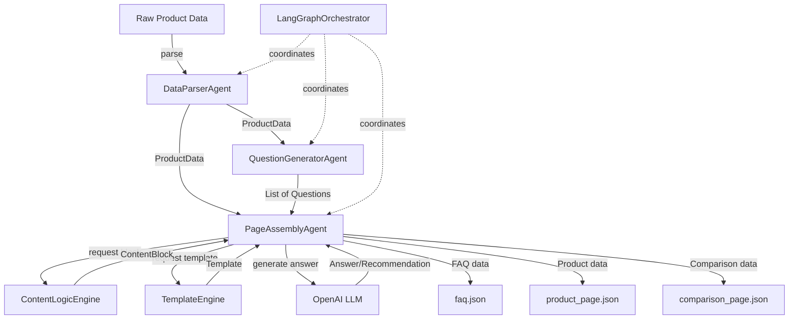

# Project Documentation

## Problem Statement

The assignment requires building a **modular, multi-agent automation system** that transforms structured product data into machine-readable JSON content pages. This is an **engineering-focused** task emphasizing:

- **Multi-agent workflows** with clear boundaries and responsibilities
- **Automation orchestration** using DAG or similar patterns
- **Reusable content logic** through modular blocks
- **Template-based generation** with custom-designed templates
- **Structured JSON output** with validation
- **System abstraction** and comprehensive documentation

**What this is NOT:**
- Not a prompting trick or single LLM call
- Not a content quality or copywriting test
- Not a UI/website design task
- Not about domain expertise in skincare

**Input:** Single product dataset (GlowBoost Vitamin C Serum)

**Output:** Three JSON files (FAQ, Product Page, Comparison Page) with 15+ auto-generated questions

---

## Solution Overview

The system implements a **7-agent pipeline** using **LangGraph framework** for graph-based orchestration. Each agent has a single responsibility and explicit input/output contracts, ensuring modularity and extensibility.

### High-Level Flow

```
Raw Product Data
      ↓
[DataParserAgent] → Validates & structures data
      ↓
[QuestionGeneratorAgent] → Generates 15+ categorized questions
      ↓
[PageAssemblyAgent] → Assembles pages using:
      ├─ [ContentLogicEngine] → Executes logic blocks
      ├─ [TemplateEngine] → Provides templates
      └─ [LLM] → Generates answers/recommendations
      ↓
JSON Output Files (faq.json, product_page.json, comparison_page.json)
```

### Core Components

1. **Agents (7)**: Specialized workers with single responsibilities
2. **Content Logic Blocks (8)**: Pure functions for data transformation
3. **Templates (3)**: Structural definitions for pages
4. **Schemas**: Pydantic models for validation
5. **LangGraph Orchestrator**: State graph coordinator managing workflow

---

## Scopes and Assumptions

### In Scope

* Multi-agent architecture with clear boundaries  
* Automated question generation (15+ questions, 5 categories)  
* Three page types: FAQ, Product, Comparison  
* Reusable content logic blocks  
* Custom template engine  
* JSON output with validation  
* DAG orchestration pattern  
* Comprehensive documentation  

### Out of Scope

- UI/frontend implementation  
- Database persistence  
- Real-time user interaction  
- Multi-product batch processing  
- Content quality optimization (copywriting)  
- Domain expertise in skincare  

### Assumptions

1. **OpenAI API Access**: System requires valid OpenAI API key
2. **Single Product Input**: Designed for one product at a time
3. **English Language**: All content generated in English
4. **Fictional Product B**: Comparison uses auto-generated fictional product
5. **No External Research**: All content derived from input data only
6. **JSON Output**: Machine-readable format, not human-optimized prose

---

## System Design

### Agent Architecture

The system uses **6 specialized agents**, each with a single, well-defined responsibility:

#### 1. DataParserAgent

**Responsibility:** Parse and validate raw product data

**Input:**
```python
{
  "product_name": str,
  "concentration": str,
  "skin_type": str | List[str],
  "key_ingredients": str | List[str],
  "benefits": str | List[str],
  "how_to_use": str,
  "side_effects": str,
  "price": str
}
```

**Output:** `ProductData` (Pydantic model)

**Logic:**
- Normalizes string fields to lists (e.g., "Oily, Combination" → ["Oily", "Combination"])
- Validates required fields
- Ensures type safety via Pydantic

**No external dependencies** (pure data transformation)

---

#### 2. QuestionGeneratorAgent

**Responsibility:** Generate 15+ categorized questions from product data

**Input:** `ProductData`

**Output:** `List[Question]` (minimum 15 questions)

**Logic:**
- Uses OpenAI LLM to generate diverse questions
- Enforces 5 categories: Informational, Safety, Usage, Purchase, Comparison
- Minimum 3 questions per category
- Validates category membership

**Dependencies:** OpenAI API

**Example Output:**
```python
[
  Question(question="What are the main benefits?", category="Informational"),
  Question(question="Is it safe for sensitive skin?", category="Safety"),
  ...
]
```

---

#### 3. ContentLogicEngine

**Responsibility:** Execute content logic blocks

**Input:** Block name, `ProductData`, optional parameters

**Output:** `ContentBlock`

**Logic:**
- Registry pattern for block lookup
- Invokes appropriate pure function
- Returns structured content block

**Available Blocks:**
1. `benefits` - Extracts and formats benefits
2. `usage` - Formats usage instructions
3. `ingredients` - Lists ingredients with concentration
4. `safety` - Compiles safety information
5. `skin_type` - Formats skin type compatibility
6. `compare_ingredients` - Compares ingredients between products
7. `compare_benefits` - Compares benefits
8. `compare_price` - Price comparison logic

**No external dependencies** (pure functions)

---

#### 4. TemplateEngine

**Responsibility:** Manage templates and validate data

**Input:** Template name, data to validate

**Output:** Template structure or validation result

**Logic:**
- Provides template definitions (FAQ, Product, Comparison)
- Validates data against template structure
- Specifies required fields and dependencies

**Templates:**
- `faq`: FAQ page structure
- `product`: Product page with 6 sections
- `comparison`: Side-by-side comparison structure

**No external dependencies**

---

#### 5. PageAssemblyAgent

**Responsibility:** Assemble complete pages from templates and content blocks

**Input:** Template name, `ProductData`, questions (for FAQ), Product B (for comparison)

**Output:** Structured page data (dict)

**Logic:**
- Fetches template from TemplateEngine
- Invokes required ContentLogicEngine blocks
- Uses LLM to generate answers (FAQ) and recommendations (Comparison)
- Populates template fields
- Validates output structure

**Dependencies:** ContentLogicEngine, TemplateEngine, OpenAI API

**Methods:**
- `assemble_faq_page()` - Creates FAQ with Q&A pairs
- `assemble_product_page()` - Creates product page with 6 sections
- `assemble_comparison_page()` - Creates comparison with Product B

---

#### 6. ProductGeneratorAgent

**Responsibility:** Generate fictional competitor products using LLM

**Input:** `ProductData` (Product A)

**Output:** `ProductData` (Product B)

**Logic:**
- Uses OpenAI LLM to synthesize realistic competitor product
- Generates product based on Product A's characteristics
- Ensures different but comparable product attributes
- Validates output with Pydantic schema

**Dependencies:** OpenAI API

---

#### 7. LangGraphOrchestrator

**Responsibility:** Coordinate entire pipeline execution using LangGraph framework

**Input:** Raw product data

**Output:** Dictionary mapping page types to file paths

**Logic:**
- Builds state graph with 7 nodes:
  1. Parse Product A
  2. Generate Product B (LLM)
  3. Generate questions (LLM)
  4. Assemble FAQ page
  5. Assemble Product page
  6. Assemble Comparison page
  7. Save outputs
- Manages state across all nodes
- Handles errors and retries
- Executes graph workflow

**Dependencies:** All other agents, LangGraph framework

---

### Data Flow Diagram



---

### Content Logic Blocks Catalog

All blocks are **pure functions** with signature: `(ProductData, **kwargs) → ContentBlock`

| Block Name | Purpose | Input | Output |
|------------|---------|-------|--------|
| `benefits` | Extract benefits | ProductData | Benefits block |
| `usage` | Format usage instructions | ProductData | Usage block |
| `ingredients` | List ingredients | ProductData | Ingredients block |
| `safety` | Compile safety info | ProductData | Safety block |
| `skin_type` | Format skin type compatibility | ProductData | Skin type block |
| `compare_ingredients` | Compare ingredients | ProductData × 2 | Comparison block |
| `compare_benefits` | Compare benefits | ProductData × 2 | Comparison block |
| `compare_price` | Compare prices | ProductData × 2 | Comparison block |

**Example:**
```python
def generate_benefits_block(product: ProductData, **kwargs) -> ContentBlock:
    return ContentBlock(
        block_type="benefits",
        content={
            "title": "Key Benefits",
            "items": product.benefits,
            "description": f"{product.product_name} offers multiple benefits."
        }
    )
```

---

### Template Specifications

#### FAQ Template

**Structure:**
```json
{
  "page_type": "faq",
  "product_name": "string",
  "faq_items": [
    {
      "question": "string",
      "answer": "string",
      "category": "Informational|Safety|Usage|Purchase|Comparison"
    }
  ],
  "total_questions": "integer"
}
```

**Required Fields:** `page_type`, `product_name`, `faq_items`, `total_questions`

**Dependencies:** QuestionGeneratorAgent (questions), LLM (answers)

---

#### Product Template

**Structure:**
```json
{
  "page_type": "product",
  "product_name": "string",
  "sections": {
    "overview": {...},
    "benefits": {...},
    "ingredients": {...},
    "usage": {...},
    "safety": {...},
    "skin_type": {...}
  }
}
```

**Required Sections:** overview, benefits, ingredients, usage, safety, skin_type

**Dependencies:** 
- `benefits_block`
- `ingredients_block`
- `usage_block`
- `safety_block`
- `skin_type_block`

---

#### Comparison Template

**Structure:**
```json
{
  "page_type": "comparison",
  "products": {
    "product_a": {...},
    "product_b": {...}
  },
  "comparisons": {
    "ingredients": {...},
    "benefits": {...},
    "price": {...},
    "skin_types": {...}
  },
  "recommendation": "string"
}
```

**Required Fields:** `products`, `comparisons`

**Dependencies:**
- `compare_ingredients_block`
- `compare_benefits_block`
- `compare_price_block`
- LLM (recommendation)

---

### Orchestration Flow (DAG)

```
┌─────────────────────────────────────────────────────────┐
│                  OrchestratorAgent                      │
└────────────────────┬────────────────────────────────────┘
                     │
        ┌────────────┴────────────┐
        ▼                         ▼
   [Step 1]                  [Step 2]
Parse Product A           Parse Product B
        │                         │
        └────────────┬────────────┘
                     ▼
                 [Step 3]
           Generate Questions
                     │
        ┌────────────┼────────────┐
        ▼            ▼            ▼
    [Step 4]     [Step 5]     [Step 6]
  Assemble FAQ  Assemble     Assemble
     Page       Product      Comparison
                 Page          Page
        │            │            │
        ▼            ▼            ▼
   faq.json   product_page.  comparison_
                 json          page.json
```

**Execution Order:**
1. DataParserAgent parses Product A
2. DataParserAgent parses Product B (fictional)
3. QuestionGeneratorAgent generates questions
4. PageAssemblyAgent creates FAQ page
5. PageAssemblyAgent creates Product page
6. PageAssemblyAgent creates Comparison page

**Parallelization Opportunities:**
- Steps 4, 5, 6 can run in parallel (independent)
- Content logic blocks within PageAssemblyAgent can be parallelized

---

### Agent Responsibility Matrix

| Agent | Input | Output | External Deps | Pure Function |
|-------|-------|--------|---------------|---------------|
| DataParserAgent | Raw dict | ProductData | None | Yes |
| QuestionGeneratorAgent | ProductData | List[Question] | OpenAI | No |
| ContentLogicEngine | Block name, ProductData | ContentBlock | None | Yes |
| TemplateEngine | Template name | Template structure | None | Yes |
| PageAssemblyAgent | Template, ProductData, Questions | Page dict | OpenAI, ContentLogicEngine, TemplateEngine | No |
| ProductGeneratorAgent | ProductData | ProductData | OpenAI | No |
| LangGraphOrchestrator | Raw dict | File paths | All agents | No |

---

### System Architecture Diagram

```
┌─────────────────────────────────────────────────────────────────┐
│                         USER INPUT                              │
│                  (GlowBoost Product Data)                       │
└────────────────────────────┬────────────────────────────────────┘
                             │
                             ▼
┌─────────────────────────────────────────────────────────────────┐
│                    ORCHESTRATOR AGENT                           │
│  ┌──────────────────────────────────────────────────────────┐  │
│  │                    DAG Coordinator                        │  │
│  │  • Manages execution flow                                │  │
│  │  • Handles data passing                                  │  │
│  │  • Writes JSON outputs                                   │  │
│  └──────────────────────────────────────────────────────────┘  │
└────────┬────────────┬────────────┬────────────┬────────────────┘
         │            │            │            │
         ▼            ▼            ▼            ▼
    ┌────────┐  ┌─────────┐  ┌─────────┐  ┌─────────┐
    │ Data   │  │Question │  │ Content │  │Template │
    │ Parser │  │Generator│  │  Logic  │  │ Engine  │
    │ Agent  │  │  Agent  │  │ Engine  │  │         │
    └────────┘  └─────────┘  └─────────┘  └─────────┘
         │            │            │            │
         └────────────┴────────────┴────────────┘
                      │
                      ▼
              ┌──────────────┐
              │     Page     │
              │   Assembly   │
              │    Agent     │
              └──────┬───────┘
                     │
         ┌───────────┼───────────┐
         ▼           ▼           ▼
    ┌────────┐  ┌────────┐  ┌────────┐
    │  FAQ   │  │Product │  │Compari-│
    │  Page  │  │  Page  │  │  son   │
    │  JSON  │  │  JSON  │  │  JSON  │
    └────────┘  └────────┘  └────────┘
```

---

## Key Design Decisions

### 1. Why LangGraph Framework?

**Rationale:** LangGraph provides:
- True graph-based workflow execution
- State management across nodes
- Built-in error handling and retry mechanisms
- Industry-standard orchestration pattern
- Better than custom sequential scripts

**Alternative Considered:** Custom DAG implementation (rejected - reinventing the wheel)

### 2. Why Pydantic for Schemas?

**Rationale:**
- Automatic validation
- Type safety
- JSON serialization
- Clear error messages

### 3. Why Registry Pattern for Content Blocks?

**Rationale:**
- Easy to add new blocks
- Decouples block definition from execution
- Enables dynamic block selection

### 4. Why Separate Template Engine?

**Rationale:**
- Templates are reusable across different products
- Validation logic centralized
- Easy to modify template structure

### 5. Why OpenAI for Question Generation?

**Rationale:**
- Generates diverse, natural questions
- Handles categorization
- Produces realistic user queries

**Alternative Considered:** Rule-based generation (rejected due to lack of diversity)

---

## Extensibility

The system is designed for easy extension:

### Adding a New Content Logic Block

```python
# In content_logic_blocks.py
def generate_new_block(product: ProductData, **kwargs) -> ContentBlock:
    return ContentBlock(
        block_type="new_block",
        content={...}
    )

# Register it
CONTENT_LOGIC_REGISTRY["new_block"] = generate_new_block
```

### Adding a New Template

```python
# Create new_template.py
class NewTemplate:
    @staticmethod
    def get_structure():
        return {...}
    
    @staticmethod
    def validate(data):
        return True

# Register in TemplateEngine
self.templates["new"] = NewTemplate
```

### Adding a New Agent

1. Create agent file in `src/agents/`
2. Define clear input/output contract
3. Implement single responsibility
4. Register in OrchestratorAgent

---

## Performance Considerations

- **LLM Calls:** 3-4 API calls per pipeline run (1 for Product B, 1 for questions, 1 batched for FAQ answers, 1 for recommendation)
- **Execution Time:** ~20-40 seconds (depends on OpenAI API latency)
- **Cost:** ~$0.02-0.05 per run (using gpt-4o-mini)

**Optimizations Implemented:**
- Batched FAQ answer generation (15+ calls -> 1 call)
- Retry logic for transient failures
- Efficient state management with LangGraph

---

## Validation Strategy

1. **Schema Validation:** Pydantic ensures type safety
2. **Template Validation:** TemplateEngine validates structure
3. **JSON Validation:** Output files validated before writing
4. **Content Validation:** Ensures no hallucinated facts (answers derived from input only)

---

## Error Handling

- **Invalid Input:** DataParserAgent raises `ValueError`
- **LLM Failures:** Graceful degradation with default responses
- **Missing Fields:** Pydantic validation errors
- **Template Mismatch:** TemplateEngine validation warnings

All errors logged with context for debugging.
